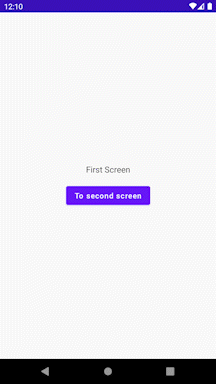

# Compose-Navigation-Basics

<div align="left">
 
</div>

## Table of Contents
* [About The Project](#about-the-project)
* [Tech](#tech)
* [Contact](#contact)

## About The Project
This is a very simple Android application project only to see the basics of navigation component in Jetpack Compose.

In this app, there are three screens as Composables. First Screen has a button to navigate to Second Screen and Second Screen has a button to navigate to Third Screen and Third Screen has a button to navigate to First Screen.

In Second Screen, popUpTo() function is being used to configure back stack.

```kotlin
Button(onClick = { navController.navigate("ThirdScreen"){popUpTo("FirstScreen")} }) {
    Text(text = "To third screen")
}
```

So when the back button is clicked on third screen, the navigation component navigates to First Screen.

## Tech
* [Navigation Component](https://developer.android.com/jetpack/compose/navigation) - Link for more information
* [Jetpack Compose](https://developer.android.com/jetpack/compose)


## Contact
* [ensertyazilim@gmail.com](#)
